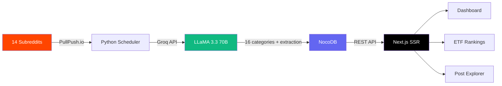

# Grepr

Grepr scrapes finance subreddits (r/vosfinances, r/Bogleheads, r/ETFs and more), runs them through Groq AI to categorize and summarize, then shows everything on a dashboard.

Built this to stop scrolling Reddit for finance advice and just have it all in one place.

## How it works

1. Scheduler fetches posts daily from 14 subreddits via PullPush.io
2. Groq AI (LLaMA 3.3 70B) categorizes each post into 16 categories (ETF, Immobilier, Crypto, Epargne, etc.)
3. AI extracts financial data — patrimoine, revenus, savings, amounts mentioned
4. Everything gets stored in NocoDB
5. Next.js dashboard displays posts, ETF comparisons, and category insights

## Stack

**Frontend** — Next.js 16, React 19, TypeScript, Tailwind v4, Radix UI, Auth.js v5 (Google OAuth)
**Backend** — Python 3.12, Groq API (LLaMA 3.3 70B), DeepSeek fallback
**Data** — PullPush.io + PRAW (Reddit), NocoDB
**Deploy** — Docker, Dokploy on Hetzner VPS, Traefik reverse proxy

## Features

- **Dashboard** — Editorial bridge page: featured hero post (rotates through top 5 per visitor), trending categories, ETF snapshot
- **Post Explorer** — Flat editorial feed, source/category pills, quality-score ranking
- **ETF Rankings** — Data cockpit with 15+ ETFs (ISIN, TER, PEA/CTO eligibility, mention counts, sentiment)
- **AI Categorization** — 16 categories with tags, summaries, consensus strength
- **Financial Extraction** — Detects patrimoine, revenus, savings, amounts via regex
- **FR/EN Language Toggle** — Full bilingual interface (~140 translated strings), localStorage persistence
- **Dark/Light Theme** — Full theme support with editorial/cockpit design system

## Architecture



## Run it yourself

```bash
git clone https://github.com/Jelil-ah/mygrepr.git
cd mygrepr

# backend
cp .env.example .env   # fill in your keys
pip install -r requirements.txt
python scheduler.py dry  # test run

# frontend
cd frontend
npm install
cp .env.example .env.local  # add NOCODB_URL, NOCODB_TOKEN, NOCODB_TABLE_ID
npm run dev
```

## Scheduler

```bash
python scheduler.py          # daily loop (runs at 6:00)
python scheduler.py dry      # one-time fetch, no push
python scheduler.py status   # see progress
python scheduler.py reset    # start fresh
```

## Project structure

```
├── backend/
│   ├── config.py              # subreddits, categories, API config
│   ├── fetchers/reddit.py     # PullPush.io + PRAW fetcher
│   ├── processors/ai.py       # Groq AI categorization & extraction
│   └── db/nocodb.py           # NocoDB client
├── frontend/
│   └── src/
│       ├── app/               # Next.js 16 app router (pages, API routes)
│       ├── components/        # dashboard, UI, navigation
│       ├── lib/               # NocoDB client, ETF database, i18n, utils
│       └── types/             # TypeScript interfaces
├── scheduler.py               # daily orchestrator
├── Dockerfile                 # backend container
└── Procfile                   # PaaS entry point
```
